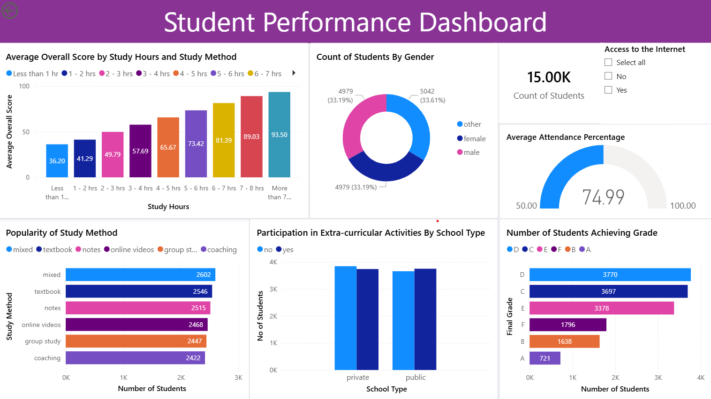
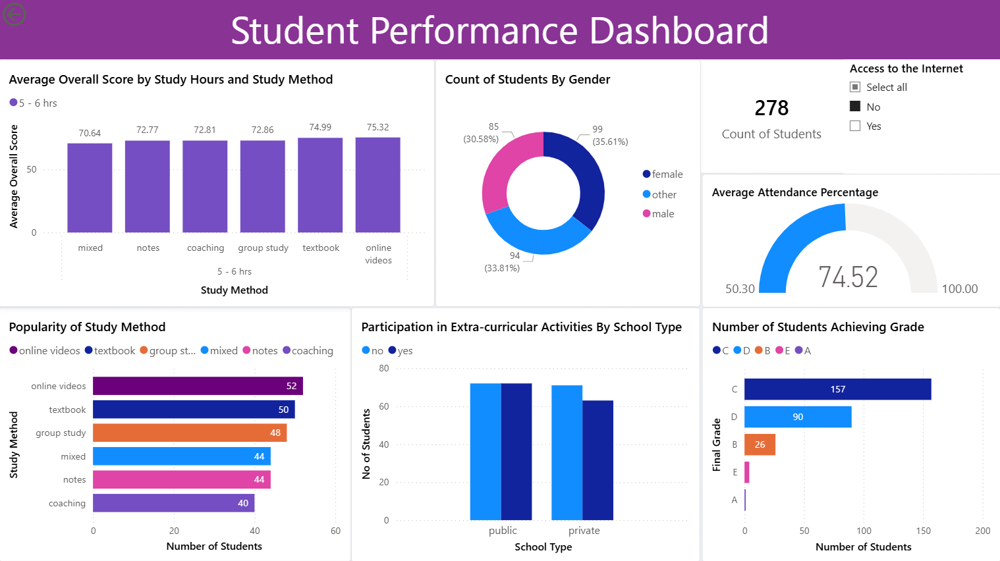

# Student Performance Analysis Dashboard

## Project Overview
This project is an **interactive dashboard** created using **Microsoft Power BI** and designed to analyze student performance. It examines how academic performance can vary on the basis of study habits, methods and access to resources.  

---

## Dataset
- **Source:** Student Performance Dataset 
- **Link:** https://www.kaggle.com/datasets/kundanbedmutha/student-performance-dataset
- **Platform:** Kaggle

---

## Data Cleaning and Modeling
The following transformations were applied to ensure consistency of data:

- Removed **duplicate** records in Microsoft Excel after download
- Standardized **Grade** values for visualization by converting them to uppercase in PowerBI
- Grouped **Study Hours** into categories using a list for better comparison
- Formatted **Internet Access** to proper case to improve readability in slicers

---

## Dashboard Features
The dashboard includes:

- **Bar Graph:** Average Overall Score by Study Hours, can be drilled down to Average Score by Study Method 
- **Bar Graph:** Popularity of Study Methods by Student Count
- **Donut Chart:** Student Distribution by Gender 
- **Bar Chart:** Number of Students Achieving Grade 
- **Clustered Bar Chart:** Extracurricular Participation by School Type 
- **Slicer:** Internet Access 
- **KPI Card:** Total Number of Students 

---

## Key Analytical Questions Answered
- How do study duration hours impact overall academic performance? How does different study methods relate to scores?
- Which study methods are the most popular among students?
- How are students distributed across genders?
- How many students are achieving a particular grade? 
- Does extracurricular participation vary by school type?
- How do insights change when data is filtered by internet access for students?

---

## Dashboard Visuals
**Main Dashboard**

**Drill-Down and Slicer Interaction**

---

## Tools Used
- **Microsoft Power BI** – Data modeling, visualization, and dashboard design
- **Microsoft Excel** – Initial data cleaning
- **Git & GitHub** – Version control

---
